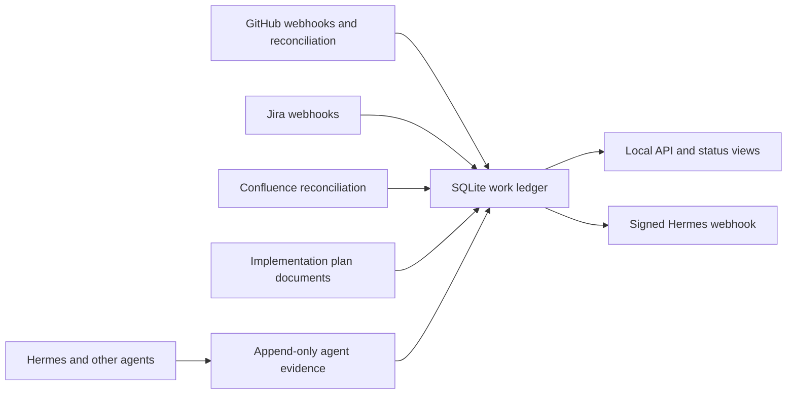

# Meta-Agent Tracker

A local-first work-observation service for engineering teams. It ingests GitHub and Jira events, reconciles them with implementation-plan documents and Confluence changes, and maintains a SQLite-backed ledger of work, milestones, blockers, and evidence.

The meta-agent is an observer, not a system of record: GitHub, Jira, Confluence, and the plan documents remain authoritative. Agent-reported events are stored as evidence and become verified only after deterministic reconciliation or a manual override.

## What it does today

- Verifies and records GitHub and Jira webhook deliveries idempotently.
- Normalizes GitHub issues, pull requests, reviews, workflow runs, and check runs into work items, blockers, and milestones.
- Reconciles configured GitHub repositories, including configured implementation-plan documents and recently completed pull requests.
- Parses deterministic `## Implementation Plan` checkbox transitions and emits milestone evidence.
- Reconciles selected Confluence content and reports requirement drift only when it affects active GitHub work.
- Delivers low-noise blocker, milestone, review, plan-update, and digest messages to Hermes through a signed webhook.
- Provides a localhost dashboard and JSON APIs for active work, recent work, repository scope, and append-only agent evidence.
- Supports macOS `launchd` supervision and a Helm deployment with an API and worker sidecar.

The current implementation roadmap and completed phases are maintained in [`docs/IMPLEMENTATION_PLAN.md`](docs/IMPLEMENTATION_PLAN.md).

## Architecture



The worker can be plan-document-driven: configure plan-document repositories and paths so plans are the durable program source of truth, while GitHub pull requests, workflow results, and webhooks provide linked evidence.

## Requirements

- Node.js 22 or later
- pnpm 11.1.1 (declared in `package.json`)
- GitHub App credentials and webhook secret for GitHub ingestion
- Optional Jira and Confluence credentials for their respective adapters

## Local quick start

1. Create local configuration. Never commit `.env`, private keys, or SQLite data.

   ```sh
   cp .env.example .env
   ```

2. Set the required values in `.env`. For a minimal API startup, set the database path and port. Configure the GitHub webhook secret before accepting GitHub deliveries.

3. Install, migrate, build, and run the verification suite.

   ```sh
   corepack enable
   corepack prepare pnpm@11.1.1 --activate
   pnpm install --frozen-lockfile
   pnpm db:migrate
   pnpm build
   pnpm check
   pnpm test
   pnpm format
   ```

4. Start the built API from the repository root. Production operation deliberately uses built output rather than `dev:api`, which runs a TypeScript watcher.

   ```sh
   set -a
   . ./.env
   set +a
   META_AGENT_ROOT="$(pwd)" NODE_PATH="$(pwd)/node_modules" node apps/api/dist/index.js
   ```

5. In a second terminal, start the worker with the same environment.

   ```sh
   set -a
   . ./.env
   set +a
   META_AGENT_ROOT="$(pwd)" NODE_PATH="$(pwd)/node_modules" node apps/worker/dist/index.js
   ```

6. Verify the local API.

   ```sh
   curl -sS http://127.0.0.1:4317/health
   curl -sS http://127.0.0.1:4317/api/active-work
   curl -sS http://127.0.0.1:4317/api/recent-work
   ```

For durable macOS-hosted operation, use `launchd` rather than background terminal processes. See [`docs/LAUNCHD_SUPERVISION.md`](docs/LAUNCHD_SUPERVISION.md).

## Configuration

All runtime configuration uses the `META_AGENT_` prefix. Start from [`.env.example`](.env.example).

Common settings:

- `META_AGENT_DATABASE_URL` — SQLite database location.
- `META_AGENT_API_HOST` and `META_AGENT_API_PORT` — API bind address and port. The default is `127.0.0.1:4317`.
- `META_AGENT_GITHUB_WEBHOOK_SECRET` — required to verify GitHub webhook signatures.
- `META_AGENT_GITHUB_APP_ID`, `META_AGENT_GITHUB_PRIVATE_KEY_PATH`, and `META_AGENT_GITHUB_INSTALLATION_ID` — GitHub App integration.
- `META_AGENT_HERMES_ENDPOINT` and `META_AGENT_HERMES_WEBHOOK_SECRET` — optional signed delivery to Hermes.
- `META_AGENT_JIRA_URL`, `META_AGENT_JIRA_PAT`, and `META_AGENT_JIRA_WEBHOOK_SECRET` — Jira adapter and webhook support.
- `META_AGENT_AGENT_EVENT_TOKEN` — protects `POST /api/agent-events` when that endpoint is exposed beyond trusted local use.
- `META_AGENT_STATUS_AUTH_USERNAME` and `META_AGENT_STATUS_AUTH_PASSWORD` — required when accessing `/status` through a public tunnel.

Keep the API bound to localhost. If GitHub must reach it, expose only the webhook proxy through a tunnel; the public host guard blocks dashboard and general API access. Webhook signature verification, body limits, rate limiting, and delivery idempotency are enforced by the API.

## Interfaces

Local browser views:

- `/dashboard` — work-item and blocker dashboard.
- `/status` — compact operational overview.

JSON endpoints:

- `GET /health` and `GET /api/health` — service health.
- `GET /api/active-work` — open work items within configured scope.
- `GET /api/recent-work` — plan documents and recently merged or closed pull requests.
- `GET /api/repos` — configured repository scope.
- `GET /api/agent-contract` and `GET /api/agent-events` — agent-evidence contract and recent evidence.
- `POST /api/agent-events` — append-only evidence intake.

Webhook endpoints:

- `POST /webhooks/github` — requires GitHub's `X-Hub-Signature-256`, event, and delivery headers.
- `POST /webhooks/jira` — requires the configured Jira webhook secret header.

See [`docs/agent-ledger-contracts.md`](docs/agent-ledger-contracts.md) before publishing agent events. Agent claims are not verified ledger truth on their own.

## Deployment

### macOS host

The operational stack is a set of `launchd` services for the API, worker, webhook-only proxy, public tunnel, and GitHub App webhook URL patcher. Install or reload it from a built checkout:

```sh
pnpm build
scripts/supervisor/install-launchd.sh --skip-build
```

Follow the reboot recovery and end-to-end validation instructions in [`docs/LAUNCHD_SUPERVISION.md`](docs/LAUNCHD_SUPERVISION.md).

### Kubernetes

The `helm/` directory supplies deployment values for an API container and worker sidecar that share SQLite storage. See [`helm/README.md`](helm/README.md) for image, release, secret, and GitOps configuration.

GitHub Actions runs build, test, formatting, and container-image smoke verification. Keep publishing credentials and registry-specific workflows private.

## Development commands

```sh
pnpm build          # TypeScript project builds
pnpm check          # TypeScript checks
pnpm test           # build, then Vitest
pnpm format         # Prettier check
pnpm db:generate    # generate a Drizzle migration after schema changes
pnpm db:migrate     # apply SQLite migrations
pnpm agent:event    # publish a structured agent-evidence event
```

## Roadmap

Implemented foundations include the source-agnostic ledger, plan parser, GitHub ingestion and reconciliation, Hermes delivery, active-work APIs, dashboard, Jira webhook adapter, Confluence reconciliation, and agent/ledger transparency contracts.

The next planned work is Phase 9: evidence-preserving summarization and classification. Phase 10 write-back remains intentionally deferred until read-only tracking is proven reliable and every external mutation can be explicitly approved and audited.

For details, constraints, and acceptance criteria, read [`docs/IMPLEMENTATION_PLAN.md`](docs/IMPLEMENTATION_PLAN.md).

## Repository layout

```text
apps/
  api/             Fastify API, dashboard, and webhook receivers
  worker/          Reconciliation and digest worker
packages/
  core/            Source-agnostic domain types
  storage/         SQLite/Drizzle schema and repository layer
  github-adapter/  GitHub event normalization
  jira-adapter/    Jira webhook normalization and client interfaces
  confluence-adapter/ Confluence client and normalization
  plan-parser/     Deterministic implementation-plan parsing
  work-catalog/    Repository, plan, PR, Confluence, and drift reconciliation
  hermes/          Signed Hermes webhook client
helm/              Shared-chart deployment values
scripts/           Agent-event and supervisor helpers
docs/              Design, contracts, scope, roadmap, and runbooks
```

## Related documentation

- [`docs/IMPLEMENTATION_PLAN.md`](docs/IMPLEMENTATION_PLAN.md) — phase roadmap and status.
- [`docs/agent-ledger-contracts.md`](docs/agent-ledger-contracts.md) — agent evidence contract and truth model.
- [`docs/source-scoping.md`](docs/source-scoping.md) — repository scoping and deployment tiers.
- [`docs/LAUNCHD_SUPERVISION.md`](docs/LAUNCHD_SUPERVISION.md) — durable macOS operation and recovery.
- [`helm/README.md`](helm/README.md) — Kubernetes deployment values and required secrets.
