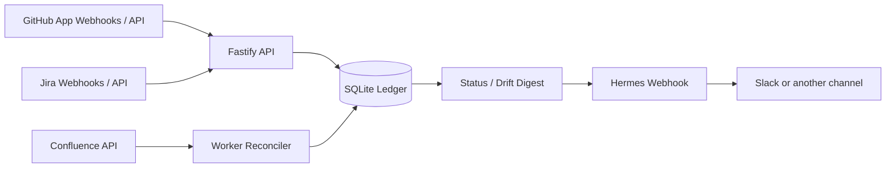

# Meta Agent Tracker

Meta Agent Tracker is a local-first work-observability service. It ingests events and reconciliation data from tools such as GitHub, Jira, Confluence, and workflow systems, normalizes them into a source-agnostic SQLite ledger, and emits concise status, blocker, milestone, and drift notifications to a delivery channel such as Hermes/Slack.

The project is designed to be environment-agnostic: all organization names, repository allowlists, credentials, webhook secrets, and delivery endpoints are configured at runtime through environment variables or deployment secrets.

## What it tracks

- Active GitHub issues and pull requests.
- Implementation-plan markdown documents and checklist milestones.
- GitHub Actions/check-run blockers and recoveries.
- Jira issue state and GitHub/Jira drift.
- Confluence requirement-page changes and linked-work drift.
- Agent-reported evidence that can later be verified against deterministic source data.
- Optional model-assisted link proposals; proposed links are advisory and never authoritative by themselves.

## Architecture



Core packages:

- `packages/core` — shared normalized domain types.
- `packages/storage` — SQLite/Drizzle schema and repository helpers.
- `packages/config` — Zod-validated runtime configuration.
- `packages/github` — GitHub webhook signature verification.
- `packages/github-adapter` — GitHub webhook normalization.
- `packages/work-catalog` — GitHub API reconciliation, plan-document scans, workflow reconciliation, drift detection, and digest delivery.
- `packages/jira-adapter` — Jira webhook/client abstractions and normalization.
- `packages/confluence-adapter` — Confluence client and page normalization.
- `packages/hermes` — optional Hermes webhook delivery client.
- `packages/llm-client` — optional advisory semantic matching.

Apps:

- `apps/api` — Fastify server, webhook receiver, status endpoints, and local dashboard/status pages.
- `apps/worker` — periodic reconciliation worker.

## Quick start

Prerequisites:

- Node.js 22+
- pnpm 11+

```bash
pnpm install --frozen-lockfile
cp .env.example .env
pnpm db:migrate
pnpm test
pnpm build
META_AGENT_ROOT=$(pwd) NODE_PATH=$(pwd)/node_modules node apps/api/dist/index.js
```

In a second shell, run the worker:

```bash
META_AGENT_ROOT=$(pwd) NODE_PATH=$(pwd)/node_modules node apps/worker/dist/index.js
```

Health check:

```bash
curl -s http://127.0.0.1:4317/health
```

## Configuration

All configuration is runtime-provided. Do not commit `.env`, private keys, tokens, webhook secrets, SQLite databases, or logs.

Important environment variables:

- `META_AGENT_DATABASE_URL` — SQLite database path; default `./data/meta-agent.sqlite`.
- `META_AGENT_API_HOST` / `META_AGENT_API_PORT` — API bind address and port.
- `META_AGENT_SCAN_INTERVAL_MS` — worker scan interval; default one hour.
- `META_AGENT_HERMES_ENDPOINT` / `META_AGENT_HERMES_WEBHOOK_SECRET` — optional outbound delivery.
- `META_AGENT_AGENT_EVENT_TOKEN` — optional bearer token for agent event ingestion.
- `META_AGENT_GITHUB_APP_ID`, `META_AGENT_GITHUB_PRIVATE_KEY_PATH`, `META_AGENT_GITHUB_INSTALLATION_ID`, `META_AGENT_GITHUB_WEBHOOK_SECRET` — GitHub App/webhook config.
- `META_AGENT_GITHUB_REPOSITORIES` — optional comma-separated repository allowlist (`owner/repo`). Omit to use repositories visible to the configured GitHub App installation(s).
- `META_AGENT_GITHUB_ASSIGNED_TO` — optional comma-separated assignee filter.
- `META_AGENT_GITHUB_PLAN_REPOSITORIES` — optional comma-separated list of repos whose docs should be scanned for plan documents. Omit to scan the configured repo set.
- `META_AGENT_GITHUB_PLAN_DOCS_PATH` — docs directory used for plan discovery; default `docs`.
- `META_AGENT_JIRA_*` — optional Jira Cloud client/webhook settings.
- `META_AGENT_CONFLUENCE_*` — optional Confluence settings.
- `META_AGENT_LLM_*` — optional advisory semantic matching settings.

See `.env.example` for a complete template.

## Secrets policy

- Secrets are read only from environment variables or files referenced by environment variables.
- The repository ignores `.env*` except `.env.example`, key material, database files, logs, and build output.
- Helm values and docs use placeholders only; use your deployment platform's secret manager for real values.
- The public repository is intentionally created from a sanitized working tree, not from private repository history.

## Extension points

The service is intentionally pluggable:

- Add source adapters that emit normalized `WorkItem`/`SourceChange` records.
- Add delivery adapters by implementing the `HermesClient`-style `send()` contract.
- Add new reconciliation passes inside the worker without changing webhook ingestion.
- Add MCP or communication-channel integrations as separate packages/apps while keeping credentials in runtime config.
- Keep model-assisted correlations advisory unless a deterministic/manual process promotes them.

## Development

```bash
pnpm check       # TypeScript
pnpm test        # build + Vitest suite
pnpm build       # workspace build
pnpm format      # Prettier check
```

Tests use local SQLite fixtures and mocked clients; they should not require live GitHub, Jira, Confluence, Hermes, Kubernetes, or ArgoCD access.

## Deployment

The `helm/` directory contains generic example values for Kubernetes-style deployments. It is deliberately provider-neutral: replace hostnames, image repositories, and secret references with values for your own environment.

## License

MIT — see [`LICENSE`](LICENSE).
