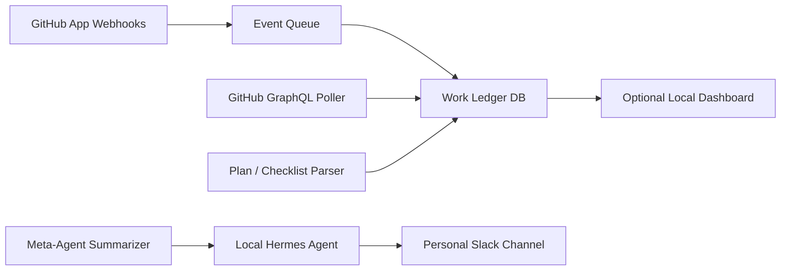
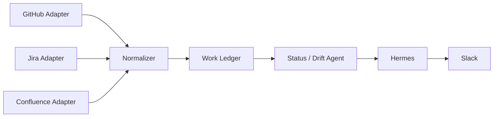

# Meta Agent

Meta Agent is a local work-observation service that keeps a source-agnostic ledger of active work across GitHub repositories, and later Jira and Confluence. Its first job is to produce a reliable status overview feed for a local Hermes agent, which can then post real-time updates to Slack.

The core idea is simple: GitHub, Jira, and Confluence are event and context sources, but the canonical "book of work" lives locally. The local ledger tracks active tasks, implementation plans, linked pull requests, CI state, requirement changes, blockers, and milestones.

## Goals

- Track active engineering work across multiple repositories and tools.
- Compare observed progress against implementation plans.
- Detect achieved milestones from task plans and checklists.
- Alert on blockers such as broken pipelines, stalled reviews, or changed requirements.
- Feed concise real-time and periodic updates into Hermes.
- Keep the architecture source-agnostic so Jira and Confluence can be added without redesigning the core.

## Non-Goals

- Replacing GitHub Projects, Jira, or Confluence as the system of record.
- Automatically mutating external systems in the first version.
- Inferring every task from unstructured activity with no explicit work item or plan.
- Building a full project-management UI before the event pipeline and ledger are useful.

## High-Level Architecture



The first implementation should be local-first:

- GitHub webhooks and/or polling provide repository events.
- A local database stores normalized work items, source snapshots, plans, and milestone events.
- A summarizer turns raw state changes into short status messages.
- Hermes handles Slack delivery.

## Source Adapter Model

The system should treat GitHub, Jira, and Confluence as adapters that emit normalized items and changes.



## Core Concepts

### Work Item

A work item is a normalized representation of a task, story, issue, pull request, ADR, or requirement page.

```text
Work Item
- id
- source: github | jira | confluence | local
- external_id
- external_url
- kind: issue | pull_request | story | task | doc | adr | requirement
- title
- status
- owner
- priority
- plan
- requirements
- linked_code_artifacts
- linked_docs
- blockers
- last_observed_change
```

### Source Change

A source change is an observed event from an external system.

Examples:

- A GitHub pull request is opened, merged, marked ready for review, or receives review feedback.
- A GitHub Actions workflow fails or recovers.
- A Jira story changes status, assignee, sprint, or acceptance criteria.
- A Confluence ADR or requirements page changes after implementation has started.

### Agent Event

An agent event is append-only telemetry/evidence from Hermes or another agent. Agent events provide context and correlation hints, but they are not final ledger truth by themselves.

Examples:

- Hermes started work on a task and linked it to a plan document.
- Hermes opened a PR and reported the branch, PR URL, and related plan items.
- Hermes observed tests passing or runtime state becoming healthy.
- Hermes suspects a plan row is stale and needs verification.

The contract is documented in [`docs/agent-ledger-contracts.md`](docs/agent-ledger-contracts.md). Agents publish events to `POST /api/agent-events` directly or through `pnpm agent:event`; humans and integrations can inspect the contract at `GET /api/agent-contract` and recent events at `GET /api/agent-events`. Status views should distinguish `agent_claimed`, `agent_observed`, `system_observed`, `verified`, and `manual_override` evidence. The worker may upgrade agent evidence to `system_observed` or `verified` only after deterministic GitHub/workflow reconciliation confirms the claim.

### Plan

Plans should be parsed from machine-readable markdown where possible.

```md
## Implementation Plan

- [ ] Add webhook ingestion
- [ ] Store events in SQLite
- [ ] Publish Hermes digest
- [ ] Add CI failure summaries
```

The parser should prefer deterministic signals, such as checkbox changes, over language-model inference. LLM summarization can help explain changes, but it should not be the primary source of truth for milestone detection.

## Feed Types

### Real-Time Alerts

Real-time alerts should be sent when attention is needed.

Examples:

```text
Blocked: example-service#211
Pipeline failed on branch feat/webhook-ledger.
Failing job: integration-tests.
Current plan step: "Store events in SQLite".
```

```text
Requirement drift: JIRA PROJ-482
Linked Confluence page "Device Provisioning Requirements" changed after PR #211 opened.
Changed section: "Timeout behavior".
Suggested action: re-check implementation assumptions.
```

### Periodic Digest

Periodic digests should provide a concise overview of active work.

Example:

```text
Status update

Milestones reached:
- #184 completed "Webhook ingestion"; PR #211 is ready for review and CI passed.

Blocked:
- #176 has a failing integration-test pipeline.

Needs attention:
- #169 has had no activity for 2 days, but remains "In Progress".
```

## First Supported Sources

### GitHub

Initial support should focus on:

- GitHub App authentication.
- Webhook ingestion for issues, pull requests, reviews, comments, check runs, check suites, workflow runs, and pushes.
- GraphQL reconciliation for GitHub Projects v2, linked issues, PR state, labels, milestones, and project fields.
- Parsing implementation plans from GitHub issue and PR bodies.

### Jira

Jira should be added as a first-class work source after the GitHub MVP.

Useful Jira signals:

- Issue status transitions.
- Sprint and epic linkage.
- Assignee changes.
- Acceptance criteria changes.
- Comments mentioning blockers.
- Links to GitHub PRs, branches, commits, and Confluence pages.

### Confluence

Confluence should be treated as a knowledge and requirements source rather than a primary task tracker.

Useful Confluence signals:

- ADR changes.
- Requirements page changes.
- Runbook updates.
- Release note updates.
- Meeting notes that mention active work items.

The system should index selected spaces or pages, not every accessible Confluence page.

## Local Components

```text
apps/
  api/              Local HTTP API and webhook receiver
  worker/           Event processing, polling, summarization
  dashboard/        Optional local web UI

packages/
  adapters/         GitHub, Jira, Confluence adapters
  core/             Domain model, ledger services, plan parser
  hermes/           Hermes client integration
  storage/          Database schema and repositories
```

This layout is provisional. The implementation plan should validate whether a monorepo-style structure is warranted before scaffolding code.

## Development

The repository uses a pnpm workspace with TypeScript project references.

```sh
pnpm install
pnpm check
pnpm test
pnpm db:generate
pnpm db:migrate
pnpm dev:api
pnpm dev:worker
```

Local configuration starts from `.env.example`.

```sh
cp .env.example .env
```

The default API health endpoint is:

```text
http://127.0.0.1:4317/health
```

The GitHub webhook endpoint is:

```text
POST http://127.0.0.1:4317/webhooks/github
```

For GitHub App setup through a tunnel, configure the public webhook URL as:

```text
https://<your-ngrok-or-tunnel-domain>/webhooks/github
```

Set the same webhook secret in GitHub and local configuration:

```env
META_AGENT_GITHUB_WEBHOOK_SECRET=...
```

Incoming GitHub webhook deliveries are rejected unless the `X-Hub-Signature-256` signature matches the configured secret. Accepted deliveries are recorded in the local ledger as source changes.

## Open Design Questions

- Should Hermes receive events over HTTP, a local queue, or a file-based inbox?
- Should the first database be SQLite for portability or Postgres for richer querying?
- Should GitHub polling be mandatory for reconciliation, even when webhooks are available?
- How should active work be discovered: GitHub Projects, assigned issues, branch naming conventions, or explicit config?
- How much write-back should be allowed later, such as Jira comments or GitHub issue updates?

## Current Status

Phase 0 is scaffolded with a TypeScript/pnpm workspace, local configuration loading, Fastify API shell, worker shell, Drizzle migrations, SQLite storage, Vitest tests, and basic domain types. The first GitHub webhook intake route is also available. The next step is Phase 1: implementing the source-agnostic core ledger model.
